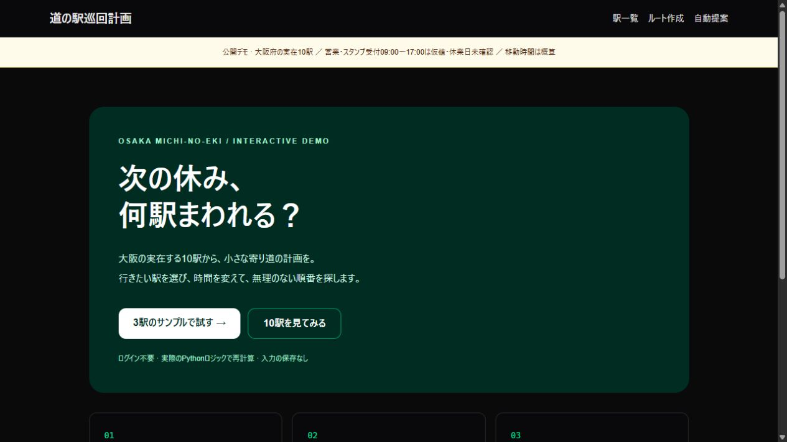

# 道の駅の巡回計画

営業時間・移動時間・滞在時間をまとめて扱い、「どの駅を、どの順番で、何時に巡るか」を計算するWebアプリです。予定の遅延や駅の除外を試して計画を比較できます。

**[公開デモ](https://michi-no-eki-portfolio.vercel.app/) · [3駅のサンプル](https://michi-no-eki-portfolio.vercel.app/routes/new/)**

[](https://michi-no-eki-portfolio.vercel.app/)

## まず試す

1. 3駅のサンプルで「この条件で計算する」を押します。
2. 到着・出発時刻、開店待ち、スタンプ受付締切までの余裕を確認します。
3. What-ifで出発遅延や駅の除外を試します。往復を選ぶと帰着時刻も確認できます。

公開デモは大阪府の実在10駅です。営業時間・スタンプ受付09:00〜17:00は計算用の仮値で、休業日・道路・渋滞は未確認です。訪問記録・写真・駅情報の更新はローカル版の機能です。

## 実装で工夫したこと

| 判断 | 実装・確認方法 |
|---|---|
| 営業時間を計画に反映する | 開店前の到着を待ち時間として加算し、出発・帰着へ反映。日付未指定では全曜日が同じ営業時間の場合だけ適用 |
| 時刻の計算をUIから分ける | FastAPIのサービス層と純粋関数を中心に、締切・滞在・What-ifを回帰テスト |
| 条件変更後の結果を正しく扱う | 入力状態と計算結果を分離し、古い非同期応答が新しい条件の画面を上書きしないよう制御 |
| 外部APIへの依存を抑える | 移動時間プロバイダを分離。標準は座標からの概算、OSRMは任意。最終ナビはGoogle Mapsへ渡す |

**Next.js / TypeScript / Tailwind CSS / FastAPI / SQLAlchemy / SQLite**。ルート計算にAPIキーは不要です。自然文の条件解釈・推薦理由はルールベースです。

## ローカルで動かす

ローカル版は自作の架空8駅を使います。PythonとNode.js 22以上が必要です。PowerShellの例です。

```powershell
git clone https://github.com/mndyant/michi-no-eki-portfolio.git
cd michi-no-eki-portfolio/backend
python -m venv .venv
.\.venv\Scripts\python.exe -m pip install -r requirements.txt
$env:MICHI_DB_PATH = Join-Path $PWD 'demo-portfolio.db'
$env:DISTANCE_PROVIDER = 'haversine'
$env:ANTHROPIC_API_KEY = ''
# 初回だけ実行。既存DBへの再投入は拒否します。
.\.venv\Scripts\python.exe scripts/seed_demo.py
.\.venv\Scripts\python.exe -m uvicorn app.main:app --host 127.0.0.1 --port 8000
```

別のPowerShellで `frontend/` に移動し、`npm ci` → `$env:NEXT_PUBLIC_API_BASE_URL = 'http://127.0.0.1:8000'` → `npm run dev` を実行し、`http://localhost:3000` を開きます。再起動・Mac/Linux・環境変数・テストは[導入ガイド](docs/USAGE_GUIDE.md#ローカル版のセットアップ)にあります。

## 根拠と制約

- [営業時間修正の検証](docs/opening-hours-fix.md)：日付未指定・曜日別設定・待ち時間・帰着表示を確認。
- [設計書](docs/DESIGN.md) / [ER図](docs/ER_DIAGRAM.md) / [テストCI](https://github.com/mndyant/michi-no-eki-portfolio/actions/workflows/ci.yml)：API・計算ロジック・CIの根拠。
- 同日の日中の巡回が対象です。日跨ぎや、開店待ちを含めた逆算の厳密な実現可能性判定は未対応です。実施設での精度は未検証です。
- 元アプリの設計範囲は近畿159駅で、公開デモ・同梱データの件数とは異なります。
- コードは[MIT](LICENSE)。データの出所と公開範囲は[data/README.md](data/README.md)・[公開デモの構成](https://github.com/mndyant/michi-no-eki-portfolio/blob/feat/vercel-demo/docs/vercel-demo.md)を参照してください。

[詳しい機能・導入・データ・利用条件](docs/USAGE_GUIDE.md)
