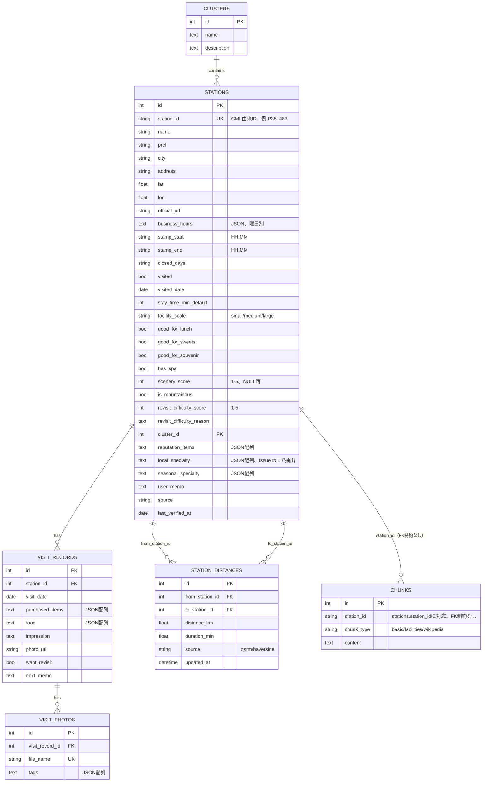
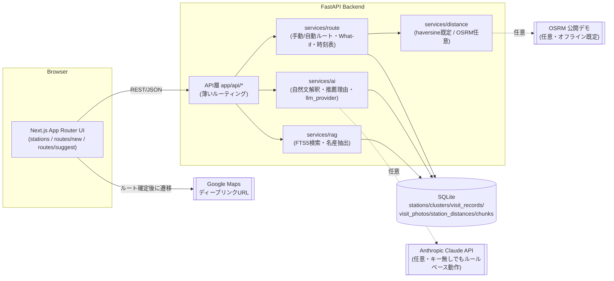

# ER図・システム構成図

`backend/app/models/` の実際のSQLAlchemyモデル定義から起こしている。
データモデルの各カラムの意味・仮値の扱いは [DESIGN.md 5章](DESIGN.md#5-データモデルsqlite--sqlalchemy) を参照。

## ER図

**補足:**
- `chunks` は `stations.station_id`（文字列）に対応するが、`load_chunks.py` と `seed.py` の
  実行順序に依存させないため、SQLAlchemyレベルでのFK制約は張っていない。
- `chunks_fts` はSQLite FTS5の仮想テーブル（`content='chunks', content_rowid='id'`）で、
  ER図には現れないが `chunks.content` の全文検索インデックスとして存在する
  （`app/db/session.py` の `create_fts_tables()` 参照）。トークナイザは日本語の分かち書き問題を
  避けるため3文字n-gramの `trigram` を使用（`app/services/rag/search.py`）。
- `routes` / `route_stops` テーブルは存在しない。ルートは保存せず、リクエストごとに
  `services/route/*` が動的に計算する設計（DESIGN.md 5章で構想されていたが未実装のまま確定）。

## システム構成図

**設計方針（DESIGN.mdと同一）:** 外部連携（OSRM・Claude API）はすべて任意のプロバイダとして
抽象化され、未設定時はオフライン/ルールベースにフォールバックする。APIキーが1つも無くても
全機能が動作する。
